# Mimari Tasarım (Proje 2 - MiniCRM)

## 1) Mimari Yaklaşım (Özet)
- **Uygulama tipi:** Node.js (Express) REST API
- **Katmanlar:** Route (HTTP) → Service (iş kuralları) → Model (Sequelize/DB)
- **Veritabanı:** PostgreSQL
- **Yapı:** Modüler (customers, orders, products), ortak bileşenler (config, logger)

## 2) Veritabanı Şeması

### 2.1 Tablolar (Hedef)
#### `customers`
- `id` (PK)
- `first_name` (NOT NULL)
- `last_name` (NULL)
- `phone` (NULL, normalize edilmiş)
- `email` (NULL)
- `address` (NULL)
- `note` (NULL)
- `is_active` (NOT NULL, default `true`)
- `created_at`, `updated_at`

Önerilen indeks/benzersizlik:
- `customers(phone)` UNIQUE (NULL’lar serbest)
- `customers(email)` UNIQUE (NULL’lar serbest)

#### `products`
- `id` (PK)
- `name` (NOT NULL)
- `sku` (NULL) (opsiyonel benzersiz)
- `track_stock` (NOT NULL, default `true`)
- `stock_quantity` (NULL) (yalnızca `track_stock=true` ise anlamlı)
- `is_active` (NOT NULL, default `true`)
- `created_at`, `updated_at`

#### `product_prices`
- `id` (PK)
- `product_id` (FK → `products.id`, NOT NULL)
- `price_type` (NOT NULL) (örn. `retail`, `wholesale`, `campaign`)
- `currency` (NOT NULL, default `TRY`)
- `amount` (NOT NULL)
- `is_active` (NOT NULL, default `true`)
- `valid_from`, `valid_to` (NULL) (opsiyonel)
- `created_at`, `updated_at`

Önerilen benzersizlik:
- (`product_id`, `price_type`, `is_active`) (iş kuralına göre)

#### `orders`
- `id` (PK)
- `customer_id` (FK → `customers.id`, NULL) (misafir sipariş için NULL olabilir)
- `guest_first_name` (NULL)
- `guest_last_name` (NULL)
- `guest_phone` (NULL)
- `guest_email` (NULL)
- `shipping_address` (NULL / NOT NULL iş kuralına göre)
- `status` (NOT NULL) (örn. `draft`, `preparing`, `shipped`, `delivered`, `cancelled`)
- `total_amount` (NOT NULL, hesaplanmış)
- `currency` (NOT NULL, default `TRY`)
- `created_at`, `updated_at`

#### `order_items`
- `id` (PK)
- `order_id` (FK → `orders.id`, NOT NULL)
- `product_id` (FK → `products.id`, NOT NULL)
- `quantity` (NOT NULL)
- `unit_price` (NOT NULL)
- `line_total` (NOT NULL)
- `created_at`, `updated_at`

#### (Opsiyonel) `order_status_history`
- `id` (PK)
- `order_id` (FK → `orders.id`, NOT NULL)
- `from_status` (NULL)
- `to_status` (NOT NULL)
- `changed_at` (NOT NULL)
- `changed_by` (NULL)

### 2.2 ER Diyagramı (Mermaid)

```mermaid
erDiagram
  CUSTOMERS ||--o{ ORDERS : places
  ORDERS ||--|{ ORDER_ITEMS : contains
  PRODUCTS ||--o{ ORDER_ITEMS : ordered
  PRODUCTS ||--o{ PRODUCT_PRICES : priced_as
  ORDERS ||--o{ ORDER_STATUS_HISTORY : transitions

  CUSTOMERS {
    int id PK
    string first_name
    string last_name
    string phone
    string email
    text address
    text note
    bool is_active
    datetime created_at
    datetime updated_at
  }

  PRODUCTS {
    int id PK
    string name
    string sku
    bool track_stock
    int stock_quantity
    bool is_active
    datetime created_at
    datetime updated_at
  }

  PRODUCT_PRICES {
    int id PK
    int product_id FK
    string price_type
    string currency
    decimal amount
    bool is_active
    datetime valid_from
    datetime valid_to
    datetime created_at
    datetime updated_at
  }

  ORDERS {
    int id PK
    int customer_id FK
    string guest_first_name
    string guest_last_name
    string guest_phone
    string guest_email
    text shipping_address
    string status
    decimal total_amount
    string currency
    datetime created_at
    datetime updated_at
  }

  ORDER_ITEMS {
    int id PK
    int order_id FK
    int product_id FK
    int quantity
    decimal unit_price
    decimal line_total
    datetime created_at
    datetime updated_at
  }

  ORDER_STATUS_HISTORY {
    int id PK
    int order_id FK
    string from_status
    string to_status
    datetime changed_at
    string changed_by
  }
```

## 3) Modüller / Servisler

### 3.1 Klasör Yapısı ve Sorumluluklar (Mevcut + Hedef)
- `src/app.js`: Express app, middleware, route mount, global error handler
- `src/server.js`: process bootstrap, DB bağlantı kontrolü, HTTP listen
- `src/config/index.js`: `.env` okuma, app/db config üretimi
- `src/lib/logger.js`: Winston logger
- `src/models/*`: Sequelize modelleri ve ilişkiler
- `src/routes/*`: HTTP endpoint’leri (controller benzeri)
- `src/services/*`: İş kuralları (route’lardan çağrılır)
- `migrations/*`: Sequelize migration dosyaları
- `tests/*`: Jest + Supertest testleri

### 3.2 Önerilen Servis Sınırları
- `CustomerService`: müşteri CRUD, duplicate kontrol, normalize/validasyon
- `ProductService`: ürün CRUD, stok takip politikası
- `OrderService`: sipariş oluşturma, stok kontrolü, toplam hesaplama, durum geçişleri
- `EtlService` (veya `scripts/etl`): Excel/CSV import + raporlama

## 4) UML Diyagramları

### 4.1 Use Case (Mermaid)

### 4.2 Sequence: “Müşteri yokken sipariş oluşturma” (Mermaid)

### 4.3 Class Diagram (Domain) (Mermaid)

## 5) API Uçlarının Listesi (Hedef)

### 5.1 Customers
- `GET /api/customers` (liste, pagination/filters)
- `POST /api/customers` (oluştur)
- `GET /api/customers/:id` (detay)
- `PUT /api/customers/:id` (güncelle)
- `DELETE /api/customers/:id` (soft delete önerilir)

### 5.2 Products
- `GET /api/products`
- `POST /api/products`
- `GET /api/products/:id`
- `PUT /api/products/:id`
- `POST /api/products/:id/prices` (fiyat tipi ekle/güncelle)

### 5.3 Orders
- `GET /api/orders` (liste, status/customer filtreleri)
- `POST /api/orders` (oluştur: müşteri veya misafir)
- `GET /api/orders/:id`
- `POST /api/orders/:id/status` (durum geçişi)

### 5.4 ETL
- (Tercih 1) CLI/script: `node scripts/etl/import-customers.js <file>`
- (Tercih 2) API: `POST /api/etl/customers/import` (dosya upload + rapor)

## 6) Logging, Konfigürasyon, Migration

### 6.1 Logging
- Mevcut: `winston` console transport, basit request log (`src/app.js`)
- Hedef:
  - Request/response loglarında `method`, `path`, `status`, `duration_ms`, `traceId`
  - Hata loglarında stack + bağlam (route, payload özet)
  - KVKK için email/telefon gibi alanlar maskelenebilir

### 6.2 Konfigürasyon
- Mevcut: `dotenv` + `src/config/index.js` (tek dosya)
- Hedef:
  - `NODE_ENV` ile `development/test/production` ayrımı
  - DB, log seviyesi, stok politikası (backorder), default currency gibi ayarların `.env` ile yönetilmesi
  - Secret’ların repoya yazılmaması (`.env.example` güncel tutulur)

### 6.3 Migration
- Mevcut: `migrations/*` (Sequelize migration)
- Hedef:
  - Uygulama `sequelize db:migrate` ile yönetilir, `sync` yalnız test izolasyonu için (veya tamamen kaldırılır)
  - Model/migration uyumu sağlanır (örn. `customers.is_active`, `orders.status NOT NULL`, foreign key’ler)
  - Yeni tablolar: `products`, `product_prices`, `order_items`, (opsiyonel) `order_status_history`

